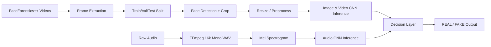
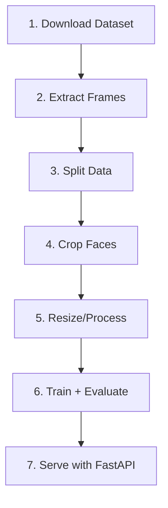
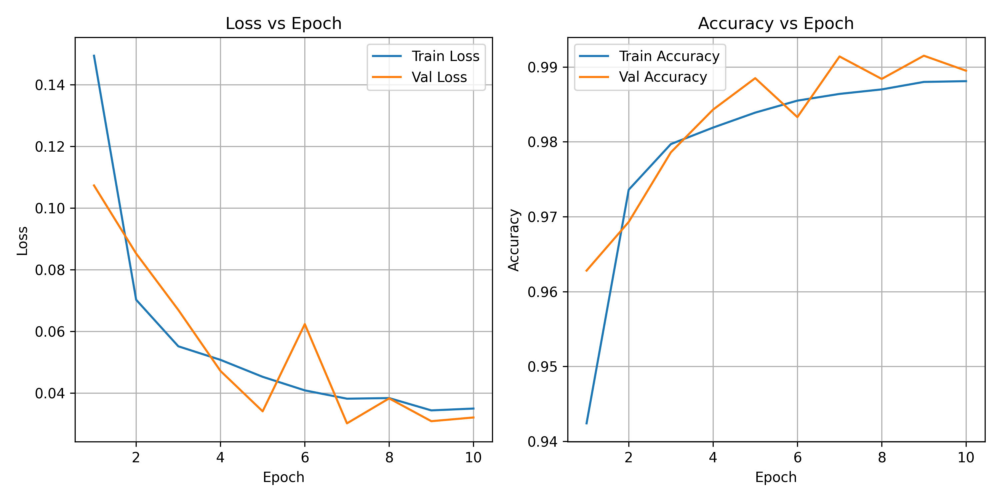
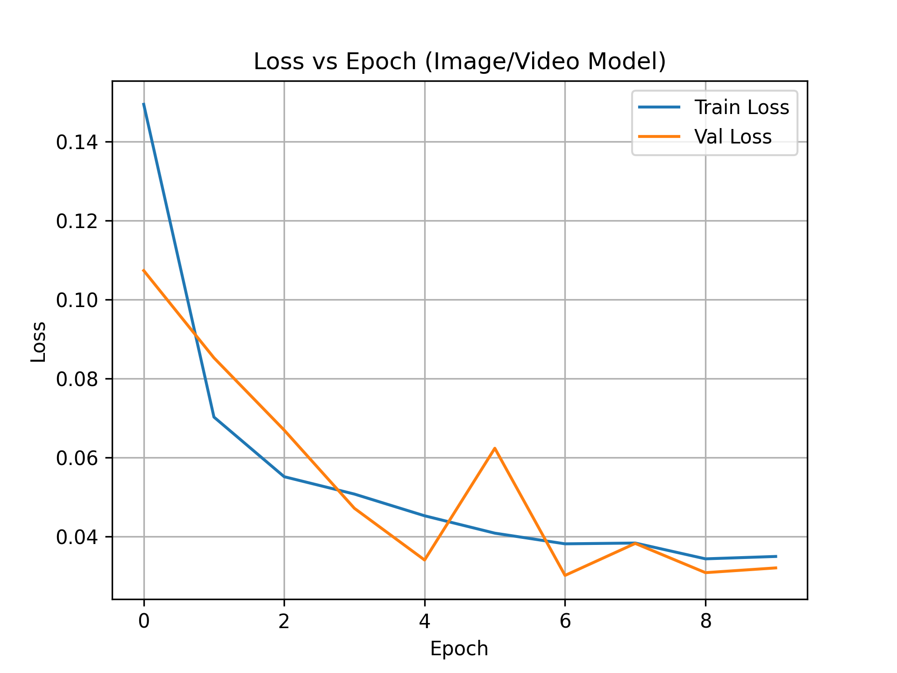
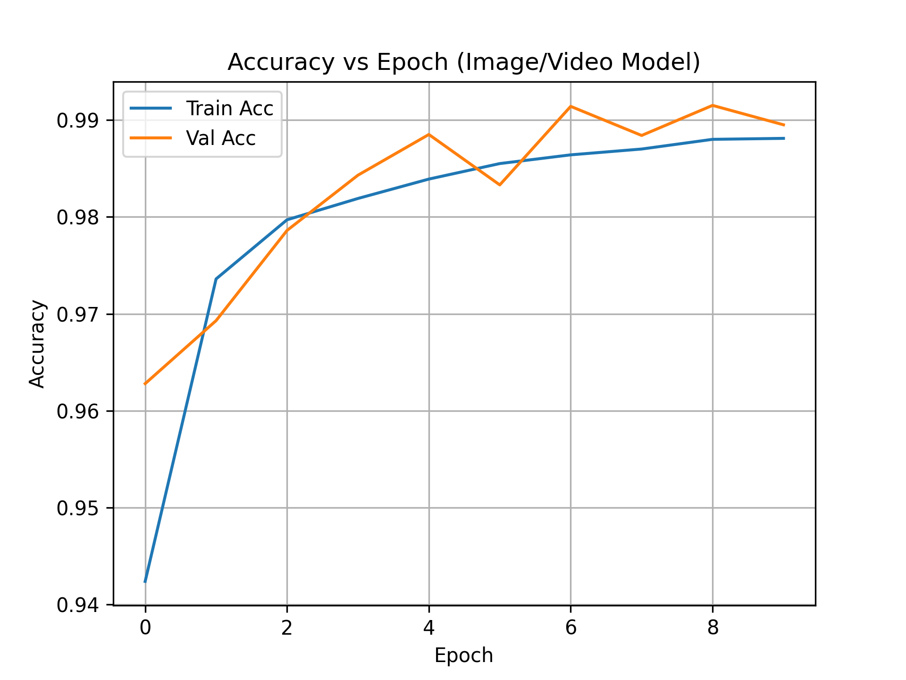
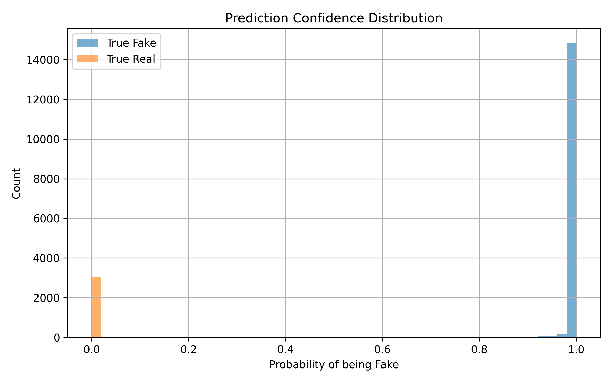
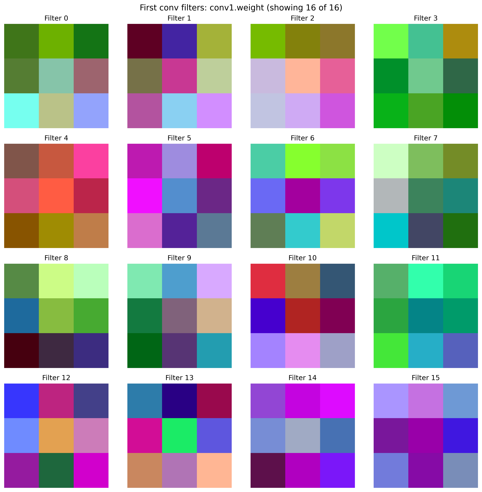
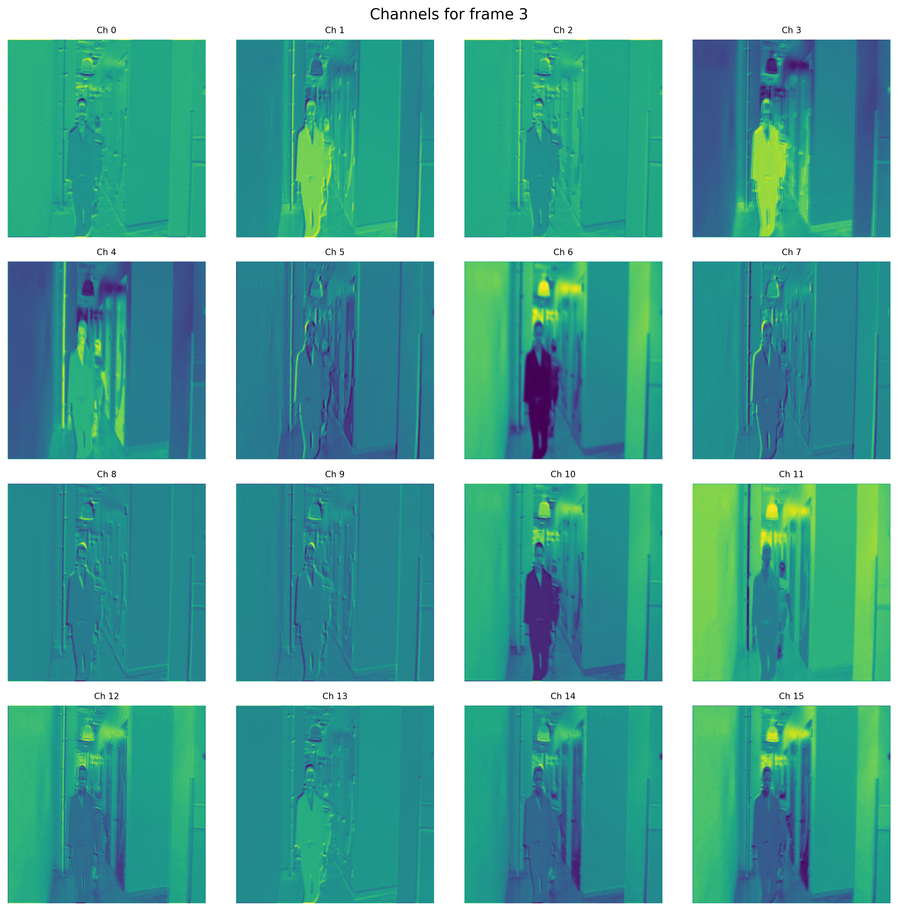
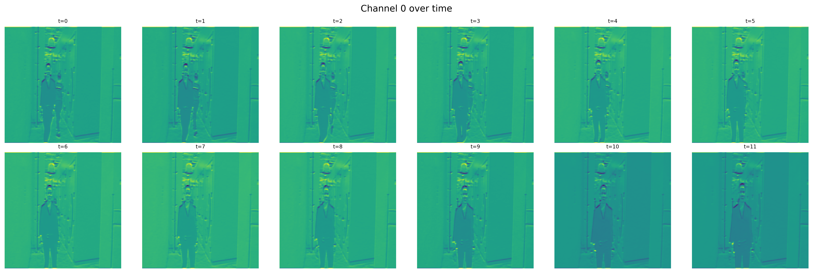

# Multimodal Deepfake Detection

<p align="center">
  
  
  
  
</p>

A practical multimodal deepfake detection system combining **image**, **video**, and **audio** analysis using CNN pipelines and a deployable **FastAPI** service.

## Quick Start
```bash
python -m venv .venv && source .venv/bin/activate
pip install -r requirements.txt
uvicorn forfastapi:app --host 0.0.0.0 --port 8000 --reload
```

## Project Snapshot
- Multimodal inference: frame, video, and audio
- Full data-preparation pipeline from videos to model-ready tensors
- Notebook-driven training and explainability workflow
- Production-style API endpoints for direct media uploads

## Architecture Diagram


## End-to-End Pipeline


## Repository Highlights
- `forfastapi.py`: API service for `/predict_frame`, `/predict_video`, `/predict_audio`, `/predict`
- `extract_frames.py`: extracts real/fake frames from source video folders
- `split_frames.py`: split into train/val/test
- `face_detect_crop.py`: Haar cascade face detection + crop
- `data_preprocess.py`: standard resize preprocessing
- `labeling.py`: CSV label creation from folder structure
- `faceforensics_download_v4.py`: FaceForensics++ download utility
- `revealed.ipynb`, `model_evaluation_and_explainability.ipynb`, `video_baseline.ipynb`: experimentation and analysis

## Data Layout (Expected)
```text
data/
  faceforensics/
    original_sequences/youtube/c23/videos
    manipulated_sequences/DeepFakeDetection/c23/videos
  extracted_frames/{real,fake}
  split_frames/{train,val,test}/{real,fake}
  cropped/{train,val}/{real,fake}
  processed/{train,val}/{real,fake}
```

## Setup
### 1. Create environment
```bash
python -m venv .venv
source .venv/bin/activate
```

### 2. Install dependencies
```bash
pip install --upgrade pip
pip install -r requirements.txt
```

### 3. Install FFmpeg
```bash
brew install ffmpeg
```

## Dataset Download (FaceForensics++)
```bash
python faceforensics_download_v4.py data/faceforensics -d original -c c23 -t videos
python faceforensics_download_v4.py data/faceforensics -d DeepFakeDetection -c c23 -t videos
```

## Data Preparation
Run in order:
```bash
python extract_frames.py
python split_frames.py
python face_detect_crop.py
python data_preprocess.py --mode all
python labeling.py
```

## Model Artifact Notes
Included in project (examples):
- `revealed_deepfake_detector.pth`
- `audio_model.pth`
- `image_simplecnn.onnx`
- `image_simplecnn_ts.pt`

`forfastapi.py` currently expects:
- `best_model.pth`
- `best_audio_model.pth`

If names differ, rename files or update paths inside `forfastapi.py`.

## Run API
```bash
uvicorn forfastapi:app --host 0.0.0.0 --port 8000 --reload
```

Health check:
```bash
curl http://localhost:8000/healthz
```

## API Endpoints
- `POST /predict_frame`
- `POST /predict_video`
- `POST /predict_audio`
- `POST /predict` (auto-routing by media extension)

Example:
```bash
curl -X POST "http://localhost:8000/predict" -F "file=@sample.mp4"
```

## Benchmark Snapshot
Replace these placeholder values with your final notebook metrics before sharing publicly.

| Modality | Accuracy | Precision | Recall | F1-score | AUC |
| --- | --- | --- | --- | --- | --- |
| Image | TBD | TBD | TBD | TBD | TBD |
| Video | TBD | TBD | TBD | TBD | TBD |
| Audio | TBD | TBD | TBD | TBD | TBD |

## Results Gallery

### Training Dynamics




### Prediction Behavior


### Explainability Views




## Troubleshooting
- Missing model files: verify checkpoint filenames in `forfastapi.py`
- Audio endpoint errors: ensure `ffmpeg` and `ffprobe` are in PATH
- Too few detected faces in video: tune `fps_interval`, `max_frames`, `min_face_frames`
- Large file push issues: keep artifacts out of Git or use Git LFS

## Author
**Shania Khan**
